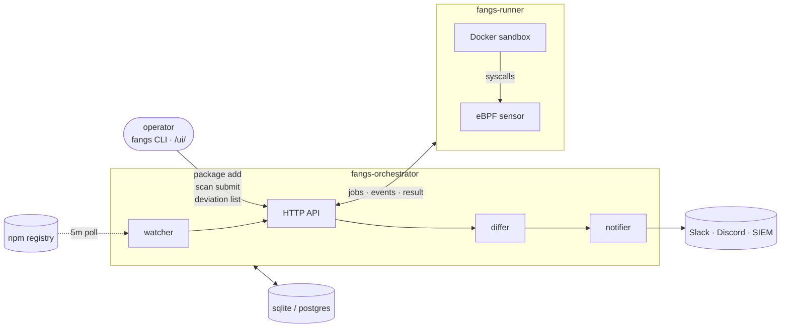

# FANGS

**F**uck **A**ll **N**PM **G**arbage **S**upply-chains.

FANGS watches a list of npm packages, runs each new release in a Docker
sandbox, captures every syscall and network connection from the host
kernel via eBPF, and flags releases that behave differently from prior
versions of the same package.

It's a delta detector. It doesn't try to classify whether a package is
malicious — it compares the current run against the package's rolling
baseline and surfaces what's new. A package that's been reading
`node_modules/lodash/*` and connecting to `registry.npmjs.org` for a
year, that suddenly starts reading `/root/.ssh/id_rsa` and connecting
to `1.2.3.4:31337`, becomes one or more deviation rows for an operator
to look at.

## Architecture



Two long-running processes (orchestrator + runner), one CLI, one
optional config file, one storage backend (sqlite default, postgres
opt-in). Plain HTTP between orchestrator and runner by default;
opt-in mTLS for production.

## Install

```bash
git clone https://github.com/irchaosclub/FANGS.git
cd FANGS
make install-hooks   # one-time per clone: gofmt pre-commit
make all             # generates vmlinux.h, compiles eBPF, builds 4 binaries
```

Full prereqs (kernel, clang, bpftool) in [`docs/INSTALL.md`](docs/INSTALL.md).

## Usage

Three terminals:

```bash
# A — orchestrator (HTTP API, UI, watcher, differ, notifier)
./bin/fangs-orchestrator

# B — runner (CAP_BPF + Docker socket, so sudo)
sudo ./bin/fangs-runner

# C — operator console
./bin/fangs package add axios            # watch axios
./bin/fangs scan submit -package lodash -version 4.18.1   # one-off scan
./bin/fangs pending                      # what's waiting on a decision?
./bin/fangs deviation list               # findings
```

Dashboard: <http://127.0.0.1:8443/ui/>. Prometheus: <http://127.0.0.1:8443/metrics>.

Day-to-day workflow:

- `fangs package add <pkg>` adds the package to the watcher and queues
  an immediate scan of the current latest version. That run becomes
  the baseline.
- Subsequent releases auto-scan. Zero-deviation runs join the
  baseline. Any-deviation runs land in `fangs pending` (or
  `/ui/pending`) waiting for a decision.
- `fangs baseline promote <run-id>` accepts a run's full fingerprint
  set into baseline (use when the deviations are legitimate behavior
  changes).
- `fangs allow add` suppresses recurring noise (CIDRs, SNIs, file path
  prefixes) before it becomes a deviation.

Full subcommand reference: `fangs help` or
[`docs/OPERATING.md`](docs/OPERATING.md).

## Config

One optional file: `config/orchestrator.yaml`. Sections currently
exposed are `watched_paths` and `allow`:

```yaml
watched_paths:
  - prefix: "/etc/"
  - prefix: "/etc/shadow"
    cred: true
  - prefix: "/root/.ssh/"
    cred: true
  - prefix: "/tmp/"
  - prefix: "/usr/"
  # ...

allow:
  paths:
    - value: "/usr/lib/"
      note: "shared library loads"
    - value: "/usr/share/zoneinfo/"
      note: "timezone DB reads"
  cidrs:
    - value: "10.0.0.0/8"
      note: "internal network"
  snis:
    - value: "telemetry.internal.example"
```

`cred: true` paths get high-severity treatment and a red row in the
UI. `allow` entries suppress matching fingerprints from becoming
deviations — global only; per-package suppressions go through
`fangs allow add -package <pkg>`.

Storage backend, listen address, TLS material, watcher cadence,
retention horizon, and notifier defaults are flags + env vars — full
reference in [`docs/CONFIGURATION.md`](docs/CONFIGURATION.md).

## Production

Defaults assume one host, one operator, localhost-only. Before
deploying anywhere a malicious package's exfil attempt actually
matters:

- Turn on mTLS — [`docs/TLS.md`](docs/TLS.md). Without it, anyone on
  the network can register a runner.
- Add at least one notifier — `fangs notifier add` — so deviations
  push instead of waiting on a dashboard refresh.
- Read [`docs/THREAT_MODEL.md`](docs/THREAT_MODEL.md). FANGS protects
  against some things and not others; the threat model spells out
  which.
- Run the runner on a dedicated host. It's running attacker-supplied
  code in a sandbox; treat it as compromised.

## Docs

- [`docs/INSTALL.md`](docs/INSTALL.md) — fresh-machine install
- [`docs/OPERATING.md`](docs/OPERATING.md) — day-2 runbook
- [`docs/CONFIGURATION.md`](docs/CONFIGURATION.md) — flags and env vars
- [`docs/TLS.md`](docs/TLS.md) — mTLS setup
- [`docs/THREAT_MODEL.md`](docs/THREAT_MODEL.md) — what FANGS protects and doesn't
- [`docs/SENSOR_SETUP.md`](docs/SENSOR_SETUP.md) — kernel prereqs + capability-based runner
- [`ARCHITECTURE.md`](ARCHITECTURE.md) — system design

## License

Apache-2.0. See [`LICENSE`](LICENSE).
